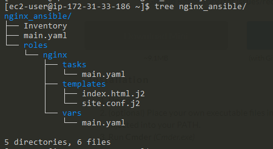

# Ansible_project_for_Nginx

Platform: AWS EC2
OS: Redhat
Port: open inbound port:  "80" to "anywhere" in EC2 Security Groups  

## Goal
Ansible play_book to setup nginx and run the service

## Installation Step
- Install python3 using sudo yum install python3
- Install Ansible using sudo yum install  ansible
- Create a new directory structure using the command . mkdir -p nginx_ansible/roles/nginx/tasks
- Create an Ansible role to install Nginx.
- Run the job.

## Directory Structure

## How to run
ansible-playbook -i Inventory  main.yaml

## How to test
input the below link into the browser.
http://ec2-3-106-136-9.ap-southeast-2.compute.amazonaws.com/

You will get the below home page.

## How to change the home page
define your own home page in file : roles/nginx/templates/index.html.j2
